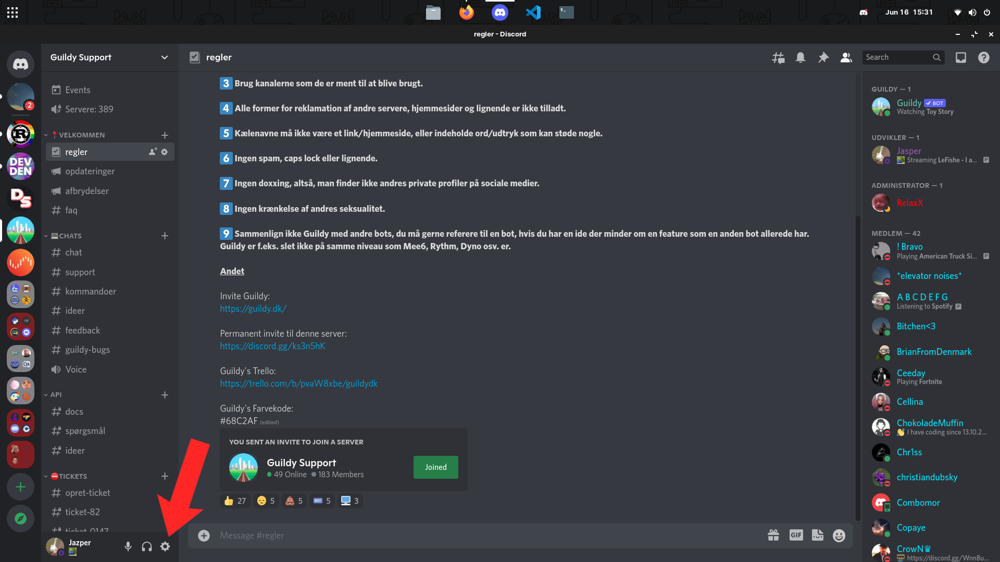
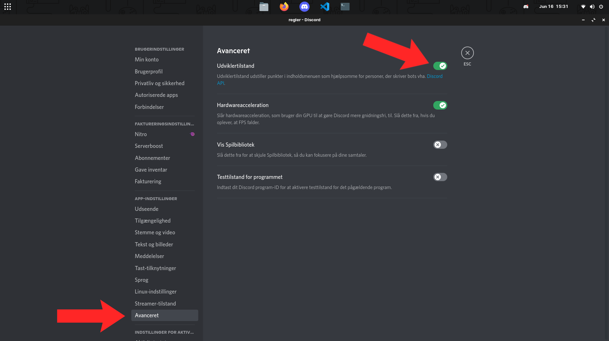
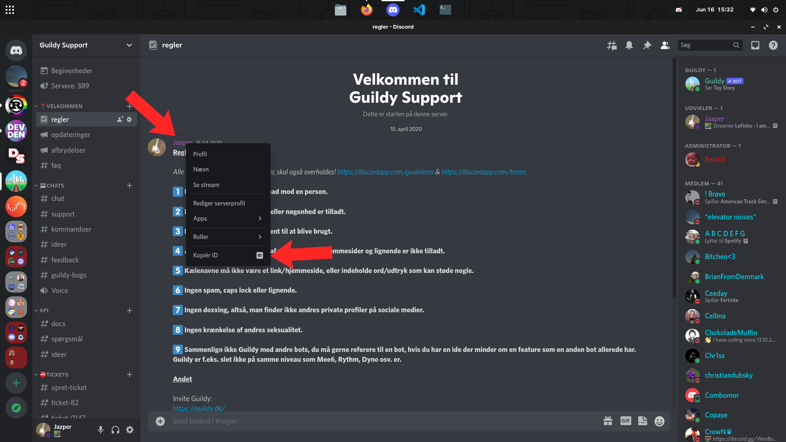

# Sådan finder du et Discord ID
Et ID på discord bliver brugt til at identificere en bruger, kanal eller server. ID'et kan ikke ændres og er derfor unikt. For at andre kan være 100% sikker på at en bruger f.eks. er reel, så skal man helst dele sit ID, da andre brugere kan bruge præcis det samme navn som dig, og hvis den bruger også har Nitro, så vil personen også kunne "stjæle" dit tag (De 4 cifre efter #).
Her er et eksempel:  
Min discord bruger hedder **Jazper#2621**, jeg har ikke nitro, og der er en anden der gerne vil lade som om at han er mig. Han køber nitro og laver sit brugernavn om til Jazper. Fordi han har nitro, så kan han også ændre sit Tag, så det ændre han til **2621**, det samme som mit. Da jeg ikke har nitro, så vil jeg nu få et nyt tag, fordi nitro brugere får "tag prioritet". Så nu har jeg brugeren **Jazper#6489** og ham der vil efterligne mig har nu mit gamle **Jazper#2621**.  

Hvis du vil dele din bruger med andre, så de f.eks. kan tilføje dig, så brug et link i stedet for bruger+tag, linket vil virke indtil du eller discord sletter din bruger.
Udskift DISCORD_ID med dit 17 eller 18 cifrede ID. Nedenunder er der en hurtig Guide til, hvordan du finder dit eget eller andres ID.  
**https://discord.com/users/DISCORD_ID**  

**1)** Du skal først ind i indstillinger:  

**2)** Derefter skal du finde den knap der hedder "Advanceret", herinde har du muligheden for at aktivere "Udviklertilstand":

**3)** Du kan nu højreklikke på brugere, kanaler og servere for at kopiere deres ID. Du vil nederst på dropdown menuen se en knap, hvor der står "Kopiér ID", når du trykker på denne bliver ID'et kopieret til udklipsholderen som du så kan sætte ind et andet sted (CTRL+V):

